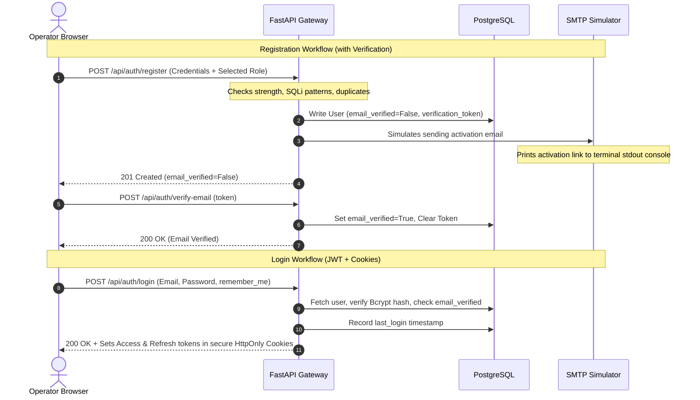

# Advanced Authentication Platform & Insider Threat Intelligence System

A production-ready User and Entity Behavior Analytics (UEBA) platform with a secure, responsive authentication gateway built using **React.js** (Vite), **FastAPI** (Python), and **PostgreSQL**.

---

## 🔒 Security Architecture

*   **Cryptographic Passwords:** Dynamic password hashing using native `Bcrypt`.
*   **Token Rotation:** Double JWT system utilizing brief access tokens (30 mins) and long-lived refresh tokens (7 days) stored in secure, HttpOnly, SameSite cookies.
*   **Security Headers:** Implements protection filters against XSS (Cross-Site Scripting), MIME Sniffing, and Clickjacking (`X-Frame-Options: DENY`, `X-Content-Type-Options: nosniff`).
*   **SQL Injection & XSS Guardrails:** Input validation sanitizes all string inputs against database injection payloads and inline script elements.
*   **Clearance Scope (RBAC):** Strict endpoint protection dependencies mapping operators to one of 4 roles: `Administrator`, `Security Manager`, `SOC Engineer`, or `Security Analyst`.

---

## 📂 Project Structure

```text
├── backend/
│   ├── app/
│   │   ├── core/
│   │   │   ├── security.py       # Password hashing & JWT generation
│   │   │   └── dependencies.py   # Cookie extraction & RBAC verification dependencies
│   │   ├── models/
│   │   │   └── models.py         # SQLAlchemy DB schemas
│   │   ├── routers/
│   │   │   ├── auth.py           # Register, login, reset, verification endpoints
│   │   │   ├── employees.py
│   │   │   └── activities.py
│   │   ├── schemas/
│   │   │   └── schemas.py        # Pydantic input/output schemas with Zod-like checkpw rules
│   │   ├── main.py               # Database seeder & middleware config
│   │   └── seed_users_postgres.py# Startup 100-user database seeding logic
│   ├── tests/
│   │   └── test_auth.py          # Pytest unit tests
│   ├── requirements.txt
│   └── Dockerfile
├── frontend/
│   ├── src/
│   │   ├── components/
│   │   │   ├── Navbar.jsx
│   │   │   └── ProtectedRoute.jsx
│   │   ├── context/
│   │   │   └── AuthContext.jsx   # Theme triggers, session hooks & Remember Me binds
│   │   ├── pages/
│   │   │   ├── Login.jsx         # Login screen, Google OAuth & visibility toggles
│   │   │   ├── Register.jsx      # Registration checklists & strength level meters
│   │   │   ├── ForgotPassword.jsx# Password recovery initiation
│   │   │   ├── ResetPassword.jsx # Recovery token updator
│   │   │   ├── VerifyEmail.jsx   # Verification landing view
│   │   │   └── Dashboard.jsx     # Tailored dashboards & avatar profile cards
│   │   ├── services/
│   │   │   └── api.js            # Axios 401 token rotators
│   │   ├── App.jsx
│   │   └── index.css             # Glassmorphic style templates (Light/Dark themes)
│   └── Dockerfile
├── mock_users_dataset.json        # 100 sample users dataset (JSON)
├── mock_users_dataset.csv         # 100 sample users dataset (CSV)
├── mock_users_dataset.sql         # 100 SQL insert statements
├── docker-compose.yml             # Single-command environment orchestration
└── Insider_Threat_Postman_Collection.json
```

---

## 🌊 Authentication Sequences



---

## 🛠️ Installation & Execution

### Option A: Running with Docker (Recommended)
Launch the entire system, database, and configurations with a single command:
```bash
docker-compose up --build
```
*   The Surveillances Frontend will be available at **`http://localhost:3000`**
*   The FastAPI Swagger docs will be available at **`http://localhost:8000/docs`**

---

### Option B: Running Locally (Manual Terminal Setup)

#### 1. Backend (FastAPI) Setup
```bash
# Navigate & activate virtual env
cd backend
.\venv\Scripts\activate

# Install requirements
pip install -r requirements.txt

# Start backend server
uvicorn app.main:app --port 8000 --reload
```

#### 2. Frontend (Vite + React) Setup
```bash
cd frontend
npm install
npm run dev
```

---

## 🧪 Testing Coverage

### Python Unit Tests
Run the unit test suite natively:
```bash
cd backend
.\venv\Scripts\python -m pytest tests/
```

### Postman API Verification
Import `Insider_Threat_Postman_Collection.json` into Postman or Thunder Client to run request scripts, capture headers, and verify responses.

---

## 🔑 Seeding Credentials

The system automatically seeds a default verified Administrator profile on launch:
*   **Email:** `admin@company.com`
*   **Password:** `AdminPass123!`
*   **Role:** `Administrator`

Alternatively, you can test Google logins or register custom operators and fetch their verification links directly from the active backend server terminal logs.