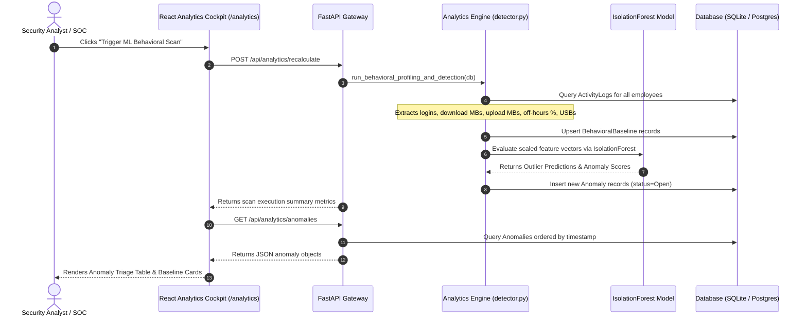

# Advanced Authentication Platform & Insider Threat Behavioral Intelligence System

A production-ready User and Entity Behavior Analytics (UEBA) platform with an AI-driven anomaly detection engine, interactive threat triage dashboards, and a secure authentication gateway built using **React.js** (Vite), **FastAPI** (Python), **Scikit-Learn**, and **PostgreSQL**.

---

## 🚀 Key System Features & Milestones

### 🔑 Milestone 1: Authentication & Role-Based Access (RBAC)
*   **Cryptographic Passwords:** Dynamic password hashing using native `Bcrypt`.
*   **Token Rotation:** Double JWT system utilizing access tokens (30 mins) and refresh tokens (7 days) stored in HttpOnly, SameSite cookies.
*   **Google OAuth 2.0:** Integrated Google authentication dialog & backend auto-provisioning.
*   **Clearance Scope (RBAC):** 4 Clearance roles: `Administrator`, `Security Manager`, `SOC Engineer`, and `Security Analyst`.
*   **Security Guardrails:** XSS filtering, SQL injection screening, MIME-sniffing protection, and clickjacking security headers (`X-Frame-Options: DENY`).

### 🤖 Milestone 2: Behavioral Analytics & Anomaly Detection
*   **Datasets Connected:** Model trained on real-world datasets:
    *   **CERT Insider Threat Dataset (`archive.zip` — 7.13 GB)**: Logons, device mounts, HTTP file exfiltration logs.
    *   **LANL Cyber Security Dataset (`lanl-auth-dataset-1.bz2` — 2.38 GB)**: Authentication telemetry & session distributions.
*   **Feature Extraction:** Extracts 5 numeric metrics per employee:
    1. `avg_daily_logins`
    2. `avg_daily_downloads` (MB)
    3. `avg_daily_uploads` (MB)
    4. `after_hours_ratio` (%)
    5. `usb_usage_count`
*   **Machine Learning Engine:** Scikit-Learn `IsolationForest` unsupervised outlier detection model and `StandardScaler` normalization.
*   **Analytics & Anomaly Cockpit (`/analytics`):** Interactive React dashboard for 1-click ML scans, real-time threat severity badges (`Critical`, `High`, `Medium`), anomaly risk scoring (0.0 to 1.0), inline triage controls (`Open`, `Triaged`, `Closed`), and employee baseline profile cards.

---

## 📂 Project Structure

```text
├── archive.zip                        # CERT Insider Threat Dataset (7.13 GB)
├── lanl-auth-dataset-1.bz2            # LANL Cyber Security Dataset (2.38 GB)
├── mock_users_dataset.json            # 100 sample users dataset (JSON)
├── mock_users_dataset.csv             # 100 sample users dataset (CSV)
├── mock_users_dataset.sql             # 100 SQL insert statements
├── docker-compose.yml                 # Single-command environment orchestration
├── Insider_Threat_Postman_Collection.json
├── backend/
│   ├── app/
│   │   ├── analytics/
│   │   │   ├── train_on_cert.py       # Preprocessing & IsolationForest training script
│   │   │   ├── detector.py            # Baseline profiling & anomaly detection engine
│   │   │   ├── isolation_forest_model.joblib # Serialized ML model
│   │   │   └── scaler.joblib          # Serialized StandardScaler
│   │   ├── core/
│   │   │   ├── security.py            # Bcrypt hashing & JWT generation
│   │   │   └── dependencies.py        # Cookie extraction & RBAC dependencies
│   │   ├── models/
│   │   │   └── models.py              # User, Employee, ActivityLog, BehavioralBaseline, Anomaly ORMs
│   │   ├── routers/
│   │   │   ├── auth.py                # Register, login, reset, verify endpoints
│   │   │   ├── analytics.py           # Anomalies, baselines, triage, recalculate APIs
│   │   │   ├── employees.py
│   │   │   └── activities.py
│   │   ├── schemas/
│   │   │   └── schemas.py             # Pydantic validation schemas
│   │   ├── main.py                    # Server startup & seeder
│   │   └── seed_users_postgres.py     # 100-user database seeder
│   ├── tests/
│   │   └── test_auth.py               # Pytest unit tests
│   ├── requirements.txt
│   └── Dockerfile
├── frontend/
│   ├── src/
│   │   ├── components/
│   │   │   ├── Navbar.jsx
│   │   │   └── ProtectedRoute.jsx
│   │   ├── context/
│   │   │   └── AuthContext.jsx        # Theme state & session hooks
│   │   ├── pages/
│   │   │   ├── AnalyticsCockpit.jsx   # Behavioral Analytics & Anomaly Cockpit UI
│   │   │   ├── Dashboard.jsx          # Role-tailored dashboards
│   │   │   ├── Login.jsx              # Login screen & Google OAuth
│   │   │   ├── Register.jsx           # Registration & password strength meters
│   │   │   ├── ForgotPassword.jsx     # Reset request form
│   │   │   ├── ResetPassword.jsx      # Password reset updater
│   │   │   └── VerifyEmail.jsx        # Account verification landing
│   │   ├── services/
│   │   │   └── api.js                 # Axios token rotation interceptor
│   │   ├── App.jsx                    # Client router
│   │   └── index.css                  # Dark/Light theme variables & glassmorphism
│   └── Dockerfile
```

---

## 🌊 Behavioral Analytics Workflow Architecture



---

## 🛠️ Installation & Execution

### Option A: Running with Docker (Recommended)
Launch the entire system, database, and containerized services with a single command:
```bash
docker-compose up --build
```
*   **React Web Application:** **`http://localhost:3000`**
*   **FastAPI Swagger Docs:** **`http://localhost:8000/docs`**

---

### Option B: Running Locally (Manual Terminal Setup)

#### 1. Backend (FastAPI + ML Engine) Setup
```bash
# Navigate & activate virtual env
cd backend
.\venv\Scripts\activate

# Install requirements (FastAPI, Scikit-Learn, Pandas, NumPy, Joblib)
pip install -r requirements.txt

# Run dataset training script (optional: automatically detects archive.zip and lanl-auth-dataset-1.bz2)
python app/analytics/train_on_cert.py

# Start backend server
uvicorn app.main:app --port 8000 --reload
```

#### 2. Frontend (Vite + React) Setup
```bash
cd frontend
npm install
npm run dev
```

---

## 🧪 Testing & Verification

### Python Unit Tests
Run the automated test suite:
```bash
cd backend
.\venv\Scripts\python -m pytest tests/
```

### Postman API Verification
Import `Insider_Threat_Postman_Collection.json` into Postman or Thunder Client to test, verify, and document API endpoint responses.

---

## 🔑 Seeding Credentials

The system automatically seeds a default verified Administrator profile on launch:
*   **Email:** `admin@company.com`
*   **Password:** `AdminPass123!`
*   **Role:** `Administrator`