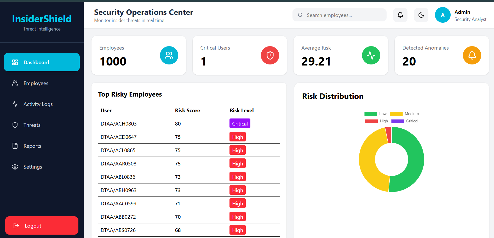
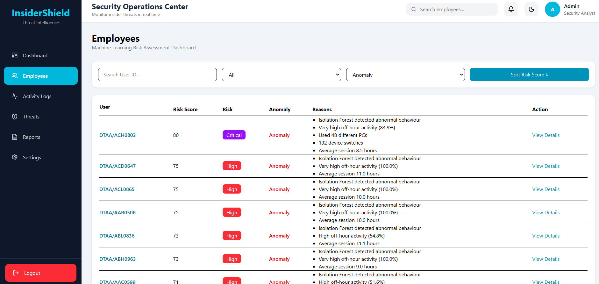
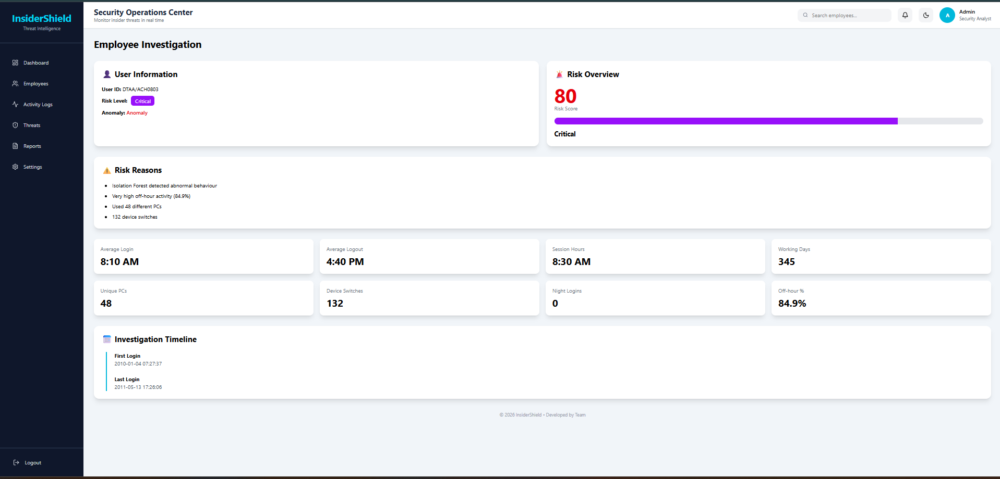
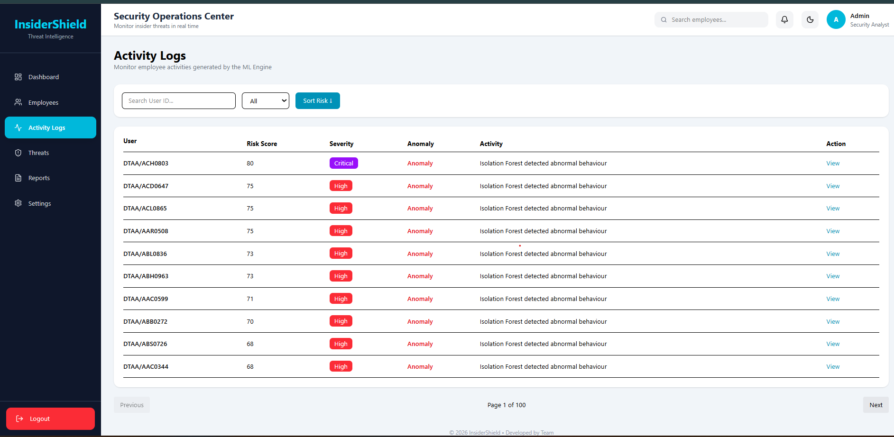

# insider-threat-behavioral-intelligence-system
AI-powered Insider Threat Behavioral Intelligence System developed as part of the Infosys Internship Program.


# Milestone 3 (Week 5–6)

## Completed

- Insider Risk Scoring Engine
- UEBA Dashboard
- Risk Analytics
- Dashboard Integration
- Risk Score API
- Risk Distribution Visualization

## Partially Implemented

- Threat Investigation workflow
- Investigation interface
- High-risk employee listing

## Planned

- Incident timeline
- Evidence management
- Activity correlation
- Investigation reports

### Frontend
- React + Vite dashboard
- Employee management page
- Employee investigation page
- Activity Logs page
- Search functionality
- Risk level filters
- Anomaly status filters
- Sorting by risk score
- Pagination
- Dashboard charts and statistics
- CSV integration with frontend

# 🛡️ Insider Threat Behavioral Intelligence System


---

## 📌 Project Overview

The **Insider Threat Behavioral Intelligence System** is an enterprise security platform developed as part of the **Infosys Springboard Internship Program**.

The objective of the project is to monitor employee behaviour, analyze activity patterns, identify anomalous behaviour using Machine Learning, calculate insider threat risk scores, and provide security analysts with an interactive dashboard for investigation.

Unlike traditional security systems that primarily defend against external attacks, this system focuses on detecting suspicious activities originating from within the organization.

---

# 🎯 Objectives

The system aims to:

- Monitor employee behavioural activities
- Generate behavioural baselines
- Detect anomalous behaviour using Machine Learning
- Calculate employee risk scores
- Assist Security Analysts during investigations
- Visualize security metrics through an interactive dashboard

---

# 🚀 Technology Stack

## Frontend

- React (Vite)
- React Router DOM
- JavaScript
- Tailwind CSS

## Backend

- FastAPI
- Python
- SQLAlchemy

## Database

- PostgreSQL

## Machine Learning

- Pandas
- NumPy
- Scikit-learn
- Isolation Forest

## Development Tools

- Git
- GitHub
- VS Code

---

# 🏗️ System Architecture

```
                Employee Activity Data
                         │
                         ▼
                Machine Learning Pipeline
                         │
         ┌───────────────┼────────────────┐
         ▼               ▼                ▼
 Feature Engineering  Behaviour Baseline  Isolation Forest
         │               │                │
         └───────────────┼────────────────┘
                         ▼
                 Risk Score Generation
                         │
                         ▼
                 FastAPI Backend APIs
                         │
                         ▼
               React Security Dashboard
                         │
                         ▼
             Security Analyst Investigation
```

---

# 📂 Project Structure

```
Insider-Threat-Behavioral-Intelligence-System
│
├── backend
│   ├── app
│   │   ├── api
│   │   ├── core
│   │   ├── models
│   │   ├── schemas
│   │   ├── services
│   │   └── main.py
│   │
│   └── .env
│
├── frontend
│   ├── public
│   ├── src
│   │   ├── assets
│   │   ├── components
│   │   ├── pages
│   │   ├── styles
│   │   ├── App.jsx
│   │   └── main.jsx
│   │
│   ├── package.json
│   └── vite.config.js
│
├── ml
│   ├── datasets
│   │   └── r1
│   │       ├── LDAP
│   │       ├── logon.csv
│   │       ├── device.csv
│   │       ├── http.csv
│   │       └── license.txt
│   │
│   ├── notebooks
│   ├── models
│   ├── outputs
│   └── scripts
│
└── README.md
```

---

# ✅ Milestone 1 Completed

## Authentication

- User Registration
- User Login
- JWT Authentication
- Role-Based Access Control

---

## Employee Management

Implemented Employee Management Module including:

- Employee List
- Search Functionality
- Employee Details
- Employee Profile Management

---

## Dashboard

Developed an interactive administrator dashboard displaying:

- Employee Statistics
- Risk Metrics
- Dashboard Charts
- Security Overview

---

# ✅ Milestone 2 Completed

## Behavioural Analytics Pipeline

Successfully implemented the complete behavioural analytics workflow.

Completed:

- Dataset Exploration
- Data Cleaning
- Feature Engineering
- Behaviour Baseline Generation

---

## Machine Learning Pipeline

Developed a complete Machine Learning workflow capable of analysing employee behaviour.

Implemented:

- Behaviour Feature Extraction
- Behaviour Baseline Calculation
- Risk Score Generation
- Dashboard JSON Generation

---

## Anomaly Detection Engine

Implemented an **Isolation Forest** based anomaly detection engine.

The model analyses employee behaviour based on:

- Login Behaviour
- Logout Behaviour
- Session Duration
- Working Days
- Device Usage
- Device Switching
- Off-hour Activities
- Night Logins

Each employee is classified as either:

- Normal
- Anomaly

---

## Risk Scoring Engine

Generated employee risk scores based on behavioural deviations.

Employees are categorized into:

- Low Risk
- Medium Risk
- High Risk
- Critical Risk

---

## Generated Outputs

The Machine Learning pipeline generates:

- baseline.csv
- anomaly_report.csv
- dashboard_data.json
- risk_scores.csv

---

# 🖥️ Frontend Modules

## Dashboard

Features include:

- Risk Overview
- Dashboard Statistics
- Charts
- Risk Distribution
- Behaviour Metrics

---

## Employee Management

Implemented:

- Search
- Risk Filter
- Anomaly Filter
- Sorting
- Pagination
- Employee Investigation

---

## Employee Investigation

Displays:

- Employee Information
- Risk Score
- Risk Level
- Behaviour Summary
- Behaviour Statistics
- Risk Reasons
- Investigation Timeline

---

## Activity Logs

Implemented:

- Search
- Severity Filter
- Sorting
- Pagination
- Activity Details

---

## Reports

Implemented Reports module for security assessment summaries.

---

## Threats

Displays high-risk employees and detected anomalies.

---

## Settings

Basic application configuration interface.

---

# 📊 Machine Learning Workflow

```
CERT Dataset
      │
      ▼
Dataset Cleaning
      │
      ▼
Feature Engineering
      │
      ▼
Behaviour Baseline
      │
      ▼
Isolation Forest
      │
      ▼
Anomaly Detection
      │
      ▼
Risk Score Calculation
      │
      ▼
Dashboard JSON
      │
      ▼
React Dashboard
```

---

# 📸 Application Screenshots

## Dashboard


---

## Employee Management


---

## Employee Investigation



---

## Activity Logs


---

# ⚙️ Installation

## Clone Repository

```bash
git clone <repository-url>
```

---

## Backend

```bash
cd backend

pip install -r requirements.txt

uvicorn app.main:app --reload
```

---

## Frontend

```bash
cd frontend

npm install

npm run dev
```

---

## Machine Learning

Run the scripts inside:

```
ml/scripts
```

to generate:

- baseline.csv

- risk_scores.csv

- anomaly_report.csv

- dashboard_data.json

---

# ✨ Features

✔ Behaviour Baseline Generation

✔ Feature Engineering

✔ Isolation Forest Anomaly Detection

✔ Risk Score Calculation

✔ Dashboard Visualisation

✔ Employee Investigation

✔ Activity Monitoring

✔ Reports Module

✔ Threat Monitoring

✔ Search

✔ Filters

✔ Sorting

✔ Pagination

---

# 🔮 Future Enhancements

The following features are planned beyond Milestone 2:

- Real-time activity monitoring
- Alert generation
- Email notifications
- PDF report generation
- Behaviour trend visualization
- Live dashboard updates
- Database integration with live activity logs
- Automated model retraining
- Advanced analytics and reporting

---

# 👨‍💻 Developer

**D. Suhas**

Infosys Springboard Internship Program

---

# 📄 License

This project is developed for educational and internship purposes under the Infosys Springboard Internship Program.