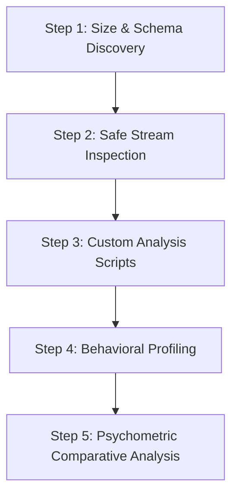

# Exploratory Data Analysis (EDA) Report

This report presents the final, comprehensive exploratory data analysis (EDA) of the security and threat-behavior datasets present in the `dataset` folder: the **CERT Insider Threat Dataset (Release 4.2)** and the **LANL Cyber Security Dataset**.

---

## 📂 Overview of the Datasets

### 1. CERT Insider Threat Dataset (r4.2)
The CERT dataset models a realistic enterprise network with simulated malicious activity (red team scenarios).
*   **`r4.2/device.csv`** (27.64 MB, 405,380 rows): USB connect/disconnect activities.
*   **`r4.2/logon.csv`** (55.80 MB, 854,859 rows): Logon and logoff events.
*   **`r4.2/file.csv`** (184.11 MB, 445,581 rows): File metadata and text content descriptions.
*   **`r4.2/psychometric.csv`** (44.6 KB, 1,000 rows): OCEAN personality model scores for 1,000 employees.
*   **`r4.2/LDAP/*.csv`** (18 monthly files, ~150 KB each): Monthly organizational roster records (roles, departments, managers).
*   **`r4.2/email.csv`** (1.30 GB, **2,629,979 rows**): Mail logs containing sender, recipient, CC/BCC lists, size, attachment counts, and content.
*   **`r4.2/http.csv`** (13.86 GB, **28,434,423 rows**): Web surfing logs containing URLs visited and content extracts.
*   **`answers/insiders.csv`** (13.8 KB, 191 rows): Ground truth timeline of true positive malicious activities.

### 2. LANL Cyber Security Dataset
This dataset captures authentic computer network authentication logs from Los Alamos National Laboratory.
*   **`small_auth.csv`** (31.21 MB, 500,001 rows): Headerless event logs containing authentication metadata.

---

## 🛠️ Step-by-Step EDA Methodology

To analyze these datasets efficiently (handling files ranging from kilobytes to 14 GB), we implemented a structured analysis framework:



### Step 1: Initial Discovery & Size Assessment
First, we scanned the workspace to determine dataset layout, sizes, and file structures. Knowing that files like `http.csv` (13.86 GB) and `email.csv` (1.30 GB) could crash standard memory-loaded tools, we mapped the directory structure first.

### Step 2: Safe Stream Inspection (Sampling)
We wrote and executed a quick inspection script [inspect_headers.py](file:///C:/Users/kaman/.gemini/antigravity-ide/brain/a9936b44-6e00-430c-b2c8-b9aff43a2da7/scratch/inspect_headers.py) to extract headers and sample data rows from each CSV file without loading the entire datasets into memory. This also allowed us to check the format (e.g. date format, delimiter types, header presence).

### Step 3: Tailored Data Extraction Scripts
Using Python’s native, memory-efficient standard library (`csv` and `collections.Counter` stream-readers), we wrote high-performance analyzer scripts:
*   [eda_analysis.py](file:///C:/Users/kaman/.gemini/antigravity-ide/brain/a9936b44-6e00-430c-b2c8-b9aff43a2da7/scratch/eda_analysis.py): Scans LDAP rosters, psychometrics, logon habits, and LANL authentication logs.
*   [eda_file.py](file:///C:/Users/kaman/.gemini/antigravity-ide/brain/a9936b44-6e00-430c-b2c8-b9aff43a2da7/scratch/eda_file.py): Inspects file extension types and splits events by insider status.
*   [full_eda.py](file:///C:/Users/kaman/.gemini/antigravity-ide/brain/a9936b44-6e00-430c-b2c8-b9aff43a2da7/scratch/full_eda.py): Performs a full streaming scan of the 1.3 GB `email.csv` and 13.86 GB `http.csv` files, extracting domain patterns, attachment counts, and web categories.

---

## 📊 Key Findings & Visual Summaries

### 1. Insider Threat Roster and Scenarios
From `answers/insiders.csv`, we mapped **191 recorded incidents** involving threat actors. There are **70 unique insiders** present in the January 2010 LDAP roster. 

The scenarios in play describe various risk signatures:
1.  **Scenario 1**: Working after-hours, using USB, and uploading data to WikiLeaks.
2.  **Scenario 2**: Surfing jobs, soliciting competitors, stealing data via USB.
3.  **Scenario 3**: Disgruntled Sysadmin placing keyloggers via USB, stealing supervisor credentials to send malicious emails.
4.  **Scenario 4**: Unauthorized login on another's PC, search/exfiltration of files via personal email.
5.  **Scenario 5**: Layoff-decimated team member uploading files to Dropbox.

### 2. Psychometric Analysis (OCEAN Personality Traits)
We compared the average OCEAN scores (Openness, Conscientiousness, Extraversion, Agreeableness, Neuroticism) between **Insiders** and **Normal Employees**:

| Trait | Insider Mean (Std) | Normal Mean (Std) | Biological/Behavioral Interpretation |
| :--- | :--- | :--- | :--- |
| **Openness (O)** | 35.10 (9.87) | 33.03 (10.68) | Insiders show slightly higher willingness to try new/risky actions. |
| **Conscientiousness (C)** | 32.53 (11.07) | 30.51 (11.29) | Roughly equivalent levels of organization/meticulousness. |
| **Extraversion (E)** | 27.80 (10.62) | 29.30 (10.97) | Insiders are marginally more introverted or less socially outgoing. |
| **Agreeableness (A)** | **26.61 (10.96)** | **28.99 (11.16)** | **Significant Difference**: Insiders show lower agreeableness, aligning with non-compliant or disgruntled behavior. |
| **Neuroticism (N)** | 29.41 (4.76) | 29.62 (4.95) | Emotional stability is comparable across both cohorts. |

> [!TIP]
> Lower **Agreeableness** coupled with higher **Openness** forms a psychometric signature that can flag individuals who may be more susceptible to policy violations when dissatisfied.

---

### 3. Temporal Logon & Device Behaviors (CERT)

#### Logon Activity Metrics:
*   **Total Logon Events**: 854,859 (470,591 Logons, 384,268 Logoffs).
*   **Temporal Distribution**: 
    *   **Normal working hours (8:00 AM - 6:00 PM)**: 59.78% of events.
    *   **After-hours (6:00 PM - 8:00 AM)**: **40.22% (343,802 events)**. This is a very high volume of after-hours work.
    *   **Weekend Logons**: **2.36% (20,159 events)**. Highly concentrated on weekdays.

#### Device Connect/Disconnect Activity:
*   **Total USB Events**: 405,380 (203,339 Connects, 202,041 Disconnects).
*   **After-hours USB Usage**: **8.40% (34,046 events)**. Since USB uploads represent data exfiltration risk, after-hours connections represent a key indicator.
*   **Top USB Users**: `AJF0370` (8,502 events) and `IBB0359` (7,852 events).

---

### 4. File Access & Type Analysis (CERT)
We analyzed **445,581 file events** in `file.csv`.
*   **Insider File Activity**: Insiders account for **28,683 file events (6.44%)**, which is disproportionately high given they represent less than 7% of the organization.
*   **Access by File Types**:

```
.doc  ██████████████████████████████ 285,897 (64.2%)
.pdf  █████████ 87,953 (19.7%)
.txt  ██ 23,033 (5.2%)
.jpg  ██ 22,895 (5.1%)
.zip  ██ 22,829 (5.1%)
.exe  ▏ 2,974 (0.7%)
```

---

### 5. Email Logs Analysis (CERT - Complete Scan)
Scanning **2,629,979 email events** revealed critical exfiltration vectors:
*   **Insider Email Footprint**: Insiders sent **119,833 emails (4.56%)**.
*   **External vs. Internal Mail**:
    *   **External Emails**: **1,264,049 (48.06% of total)**. Nearly half of all mail traffic goes outside the organization's domain (`dtaa.com`).
*   **Attachments Data**:
    *   **Total Attachments Sent**: **1,061,449** (Average of **0.4036** attachments per email).
    *   **Average Size**: **29,992.32 bytes (~30 KB)**.
*   **Top External Domains Targeted**:
    1.  `netzero.com` (174,944)
    2.  `gmail.com` (173,126)
    3.  `yahoo.com` (170,391)
    4.  `verizon.net` (165,878)
    5.  `hotmail.com` (158,843)

---

### 6. Web Surfing Logs Analysis (CERT - Complete Scan)
Scanning **28,434,423 web requests** identified specific malicious activities (Red Team Scenarios):
*   **Job Site Visits**: **269,522 requests** (e.g. `monster.com`, `indeed.com`).
    *   *Top Job Hunter*: `TVS0050` with **9,908 job-hunting visits**.
*   **Cloud Storage Uploads**: **754,324 requests** (e.g. `dropbox.com`, `drive.google`).
    *   *Top Cloud Uploader*: `HIW0536` with **10,427 upload events**.
*   **Leak Site Visits (Wikileaks)**: **69 requests**.
    *   *Significance*: Extremely rare (0.0002% of all web requests). Identifying these represents a direct correlation to Scenario 1 indicators.
    *   *Top Leak Visitors*: `EHB0824` (4 visits), `LJR0523` (4 visits), `KPC0073` (3 visits).

---

### 7. LANL Authentication Pattern Analysis
We analyzed **500,001 events** from `small_auth.csv`:
*   **Authentication Orientations**: 
    *   **LogOn**: 209,134 (41.8%)
    *   **LogOff**: 215,846 (43.2%)
    *   **Ticket Granting Service (TGS)**: 48,429 (9.7%)
    *   **Ticket Granting Ticket (TGT)**: 22,252 (4.5%)
    *   **AuthMap**: 4,340 (0.9%)
*   **Authentication Success vs. Failure**:
    *   **Success**: 496,593 (99.32%)
    *   **Fail**: **3,408 (0.68%)** (Crucial metric for identifying brute-force attempts).
*   **Network vs. Interactive Logon**:
    *   **Network Logons**: 414,580.
    *   **Interactive Logons**: 2,619.
*   **Top Network Users**: `U22@DOM1` (13,750 events) and `U66@DOM1` (10,361 events).
*   **Top Source Computer**: `C586` (32,313 events).

---

## 📈 Security Analysis & Indicators of Threat
Combining the findings, the primary behavioral anomalies to trigger alerts in our Behavioral Intelligence System are:
1.  **Low Agreeableness + High Openness**: Flagged in psychometric audits.
2.  **Anomalous After-Hours USB Connectivity**: Particularly device interactions between 6:00 PM and 8:00 AM (8.4% of total device activity).
3.  **Out-of-Pattern File Copying**: Disproportionate access to `.zip`, `.exe`, or high volumes of office docs (`.doc`, `.pdf`) by employees who do not normally transfer files.
4.  **Auth Failures (LANL)**: Correlating high authentication failure rates (out of the baseline 0.68%) with remote network logins.
5.  **Targeted Web-Surfing Anomalies**: Rapid surges in job-search URLs (Scenario 2) or visits to leak domains like `wikileaks.org` (Scenario 1) or cloud storage uploads (Scenario 5).
